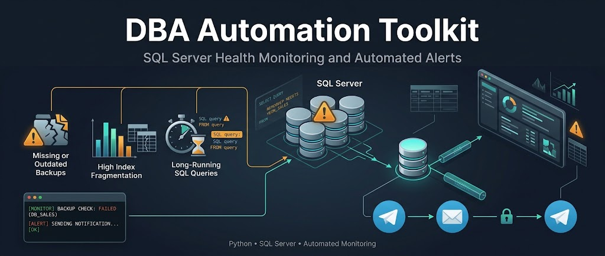

# DBA Automation Toolkit

This project monitors SQL Server health and displays alerts in the terminal or sends them to Telegram.



## Project Overview

This toolkit is designed for automated SQL Server health monitoring. It checks:

- Missing or outdated database backups
- High index fragmentation
- Long-running SQL queries

Results can be printed locally in the terminal or sent through Telegram.

## Safe Local Test Without a Database or Telegram

Run the sample mode first. It does not connect to a database or any external service, and it does not require real passwords or tokens.

```powershell
Set-Location -LiteralPath "path\to\dba-automation-toolkit"
python main.py
```

The sample output includes examples of:

- Databases with missing or outdated backups
- Highly fragmented indexes
- Long-running queries

The sample mode is configured in `.env`:

```env
RUN_MODE=sample
NOTIFY_MODE=console
```

## Connect to a Real SQL Server

For a real run, install and start SQL Server Developer or Express. You must also install Microsoft ODBC Driver 18 for SQL Server. Then install the Python dependencies:

```powershell
python -m venv .venv
.\.venv\Scripts\Activate.ps1
python -m pip install --upgrade pip
pip install -r requirements.txt
```

Update `.env` with your local SQL Server settings:

```env
RUN_MODE=sqlserver
NOTIFY_MODE=console
DB_DRIVER=ODBC Driver 18 for SQL Server
DB_SERVER=localhost
DB_PORT=1433
DB_NAME=master
DB_USER=sa
DB_PASSWORD=your_real_sql_server_password
DB_TRUST_SERVER_CERTIFICATE=yes
```

Run the application:

```powershell
python main.py
```

In `sqlserver` mode, the application loads and executes the T-SQL files from the `queries/` directory through `sql_queries.py`. Keeping SQL separate from Python improves readability, editor support, and maintainability. Some DMV queries usually require this permission:

```sql
GRANT VIEW SERVER STATE TO [your_user];
```

The application user must also have read access to `msdb.dbo.backupset`.

## Enable Telegram Notifications

Store the bot token only in `.env` and never commit it. The `.env` file is included in `.gitignore`.

```env
RUN_MODE=sqlserver
NOTIFY_MODE=both
TELEGRAM_BOT_TOKEN=your_real_bot_token
TELEGRAM_CHAT_ID=your_chat_id
```

Create a bot with `@BotFather`, then send `/start` to the bot. To find your chat ID, open this URL in a browser:

```text
https://api.telegram.org/botYOUR_TOKEN/getUpdates
```

To test Telegram with sample data and without SQL Server, use:

```env
RUN_MODE=sample
NOTIFY_MODE=telegram
```

In this mode, the sample alerts are sent to Telegram.

## Run Modes

| RUN_MODE      | NOTIFY_MODE  | Result                                 |
| ------------- | ------------ | -------------------------------------- |
| `sample`    | `console`  | Safe local test                        |
| `sample`    | `telegram` | Send sample data to Telegram           |
| `sqlserver` | `console`  | Check SQL Server and print locally     |
| `sqlserver` | `both`     | Check SQL Server and print/send alerts |

## Security

- Never write the bot token or SQL Server password in source code or GitHub.
- Commit `.env.example` only; `.env` is intentionally ignored.
- If a token is exposed, revoke it with `@BotFather` and create a new one.
